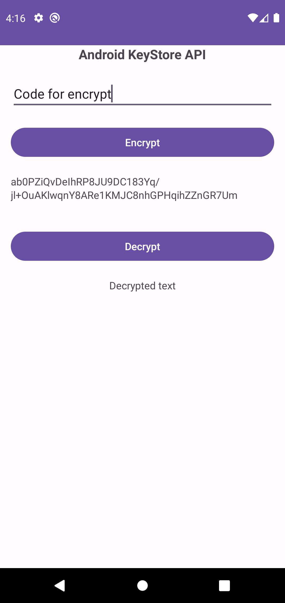
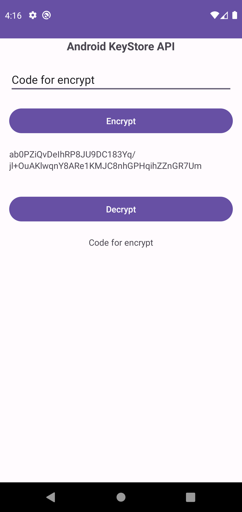

# Android Keystore API

### The Android Keystore System is a powerful tool that provides secure key storage and management, ensuring cryptographic keys remain inaccessible even if a device is compromised. In this article, we will explore how the Keystore System strengthens app security and demonstrate its use in a Kotlin and Jetpack Compose application.

### Simply put, the Android Keystore is a system that allows you to store cryptographic keys (like encryption keys) in a secure and isolated environment. The big win here is that even if someone gains access to your app’s storage, they won’t be able to get their hands on those keys. Android keeps them tucked away where even your app can’t touch them directly.

### Encrypting your data is important, but managing the encryption keys is even more critical. The Android Keystore ensures:
- Keys are hardware-backed (if supported by the device). This means keys are generated and stored inside secure hardware, making it much harder to extract them.
- Keys can’t be exported. Once a key is in the Keystore, it can only be used for operations like encryption and decryption. The raw key itself is never accessible.
- Customizable access controls. You can specify when and how a key can be used, like requiring biometric authentication (fingerprint or face unlock) to use the key.

  
    

